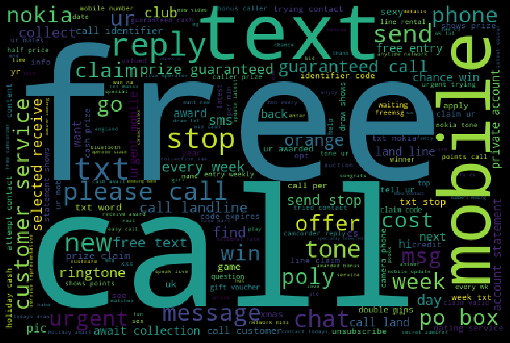

```python
from google.colab import drive
drive.mount('/content/drive')
```

    Drive already mounted at /content/drive; to attempt to forcibly remount, call drive.mount("/content/drive", force_remount=True).


```python
# Used libraries
import numpy as np
import pandas as pd
import matplotlib.pyplot as plt
import seaborn as sns
from wordcloud import WordCloud
from sklearn.model_selection import train_test_split
from sklearn.linear_model import LogisticRegression
from sklearn.model_selection import GridSearchCV

%matplotlib inline

# Text preprocessing
import nltk
from nltk.corpus import stopwords
import string
from nltk.tokenize import word_tokenize
from nltk.stem import SnowballStemmer
from sklearn.feature_extraction.text import TfidfVectorizer

import spacy
nlp = spacy.load("en")

# Warnings
import warnings
warnings.filterwarnings('ignore')
```


```python
# Download Natural Language Toolkit (run this cell once)
nltk.download('all')
```


```python
# Reading the SMS collection file

sms = pd.read_csv('/content/drive/My Drive/Machine Learning/SMS Spam Filter/SMSSpamCollection', sep="\t", header=None,
                  names=["Label", "Message"], encoding='utf-8')
```


```python
sms.head()
```


<div>
<style scoped>
    .dataframe tbody tr th:only-of-type {
        vertical-align: middle;
    }

    .dataframe tbody tr th {
        vertical-align: top;
    }

    .dataframe thead th {
        text-align: right;
    }
</style>
<table border="1" class="dataframe">
  <thead>
    <tr style="text-align: right;">
      <th></th>
      <th>Label</th>
      <th>Message</th>
    </tr>
  </thead>
  <tbody>
    <tr>
      <th>0</th>
      <td>ham</td>
      <td>Go until jurong point, crazy.. Available only ...</td>
    </tr>
    <tr>
      <th>1</th>
      <td>ham</td>
      <td>Ok lar... Joking wif u oni...</td>
    </tr>
    <tr>
      <th>2</th>
      <td>spam</td>
      <td>Free entry in 2 a wkly comp to win FA Cup fina...</td>
    </tr>
    <tr>
      <th>3</th>
      <td>ham</td>
      <td>U dun say so early hor... U c already then say...</td>
    </tr>
    <tr>
      <th>4</th>
      <td>ham</td>
      <td>Nah I don't think he goes to usf, he lives aro...</td>
    </tr>
  </tbody>
</table>
</div>


```python
# Data sample

display(sms.head(n = 10))
print('--------------------------------------------------')
```


<div>
<style scoped>
    .dataframe tbody tr th:only-of-type {
        vertical-align: middle;
    }

    .dataframe tbody tr th {
        vertical-align: top;
    }

    .dataframe thead th {
        text-align: right;
    }
</style>
<table border="1" class="dataframe">
  <thead>
    <tr style="text-align: right;">
      <th></th>
      <th>Label</th>
      <th>Message</th>
    </tr>
  </thead>
  <tbody>
    <tr>
      <th>0</th>
      <td>ham</td>
      <td>Go until jurong point, crazy.. Available only ...</td>
    </tr>
    <tr>
      <th>1</th>
      <td>ham</td>
      <td>Ok lar... Joking wif u oni...</td>
    </tr>
    <tr>
      <th>2</th>
      <td>spam</td>
      <td>Free entry in 2 a wkly comp to win FA Cup fina...</td>
    </tr>
    <tr>
      <th>3</th>
      <td>ham</td>
      <td>U dun say so early hor... U c already then say...</td>
    </tr>
    <tr>
      <th>4</th>
      <td>ham</td>
      <td>Nah I don't think he goes to usf, he lives aro...</td>
    </tr>
    <tr>
      <th>5</th>
      <td>spam</td>
      <td>FreeMsg Hey there darling it's been 3 week's n...</td>
    </tr>
    <tr>
      <th>6</th>
      <td>ham</td>
      <td>Even my brother is not like to speak with me. ...</td>
    </tr>
    <tr>
      <th>7</th>
      <td>ham</td>
      <td>As per your request 'Melle Melle (Oru Minnamin...</td>
    </tr>
    <tr>
      <th>8</th>
      <td>spam</td>
      <td>WINNER!! As a valued network customer you have...</td>
    </tr>
    <tr>
      <th>9</th>
      <td>spam</td>
      <td>Had your mobile 11 months or more? U R entitle...</td>
    </tr>
  </tbody>
</table>
</div>


    --------------------------------------------------


```python
# Data info

sms.info()
```

    <class 'pandas.core.frame.DataFrame'>
    RangeIndex: 5572 entries, 0 to 5571
    Data columns (total 2 columns):
    Label      5572 non-null object
    Message    5572 non-null object
    dtypes: object(2)
    memory usage: 87.2+ KB


```python
# Plotting the data distribution 

sms["Label"].value_counts().plot(kind = 'pie', explode = [0, 0.1], figsize = (6, 6), autopct = '%1.2f%%')
plt.ylabel('')
plt.legend(["Ham", "Spam"])
plt.show()
```


```python
# Inspecting top 10 SMS messages

topMessages = sms.groupby("Message")["Label"].agg([len, np.max]).sort_values(by = "len", ascending = False).head(n = 10)
display(topMessages)
```


<div>
<style scoped>
    .dataframe tbody tr th:only-of-type {
        vertical-align: middle;
    }

    .dataframe tbody tr th {
        vertical-align: top;
    }

    .dataframe thead th {
        text-align: right;
    }
</style>
<table border="1" class="dataframe">
  <thead>
    <tr style="text-align: right;">
      <th></th>
      <th>len</th>
      <th>amax</th>
    </tr>
    <tr>
      <th>Message</th>
      <th></th>
      <th></th>
    </tr>
  </thead>
  <tbody>
    <tr>
      <th>Sorry, I'll call later</th>
      <td>30</td>
      <td>ham</td>
    </tr>
    <tr>
      <th>I cant pick the phone right now. Pls send a message</th>
      <td>12</td>
      <td>ham</td>
    </tr>
    <tr>
      <th>Ok...</th>
      <td>10</td>
      <td>ham</td>
    </tr>
    <tr>
      <th>Ok</th>
      <td>4</td>
      <td>ham</td>
    </tr>
    <tr>
      <th>Okie</th>
      <td>4</td>
      <td>ham</td>
    </tr>
    <tr>
      <th>7 wonders in My WORLD 7th You 6th Ur style 5th Ur smile 4th Ur Personality 3rd Ur Nature 2nd Ur SMS and 1st "Ur Lovely Friendship"... good morning dear</th>
      <td>4</td>
      <td>ham</td>
    </tr>
    <tr>
      <th>Wen ur lovable bcums angry wid u, dnt take it seriously.. Coz being angry is d most childish n true way of showing deep affection, care n luv!.. kettoda manda... Have nice day da.</th>
      <td>4</td>
      <td>ham</td>
    </tr>
    <tr>
      <th>Your opinion about me? 1. Over 2. Jada 3. Kusruthi 4. Lovable 5. Silent 6. Spl character 7. Not matured 8. Stylish 9. Simple Pls reply..</th>
      <td>4</td>
      <td>ham</td>
    </tr>
    <tr>
      <th>Please call our customer service representative on FREEPHONE 0808 145 4742 between 9am-11pm as you have WON a guaranteed £1000 cash or £5000 prize!</th>
      <td>4</td>
      <td>spam</td>
    </tr>
    <tr>
      <th>Ok.</th>
      <td>4</td>
      <td>ham</td>
    </tr>
  </tbody>
</table>
</div>


```python
# Reomving stop words

%%time
spamMessages = sms[sms["Label"] == "spam"]["Message"]
hamMessages = sms[sms["Label"] == "ham"]["Message"]

spamWords = []
hamWords = []


def extractSpamWords(spamMessages):
    global spamWords
    words = [word.lower() for word in word_tokenize(spamMessages) if word.lower() not in stopwords.words("english") and word.lower().isalpha()]
    spamWords = spamWords + words
    
def extractHamWords(hamMessages):
    global hamWords
    words = [word.lower() for word in word_tokenize(hamMessages) if word.lower() not in stopwords.words("english") and word.lower().isalpha()]
    hamWords = hamWords + words

spamMessages.apply(extractSpamWords)
hamMessages.apply(extractHamWords)
```

    CPU times: user 14.4 s, sys: 1.32 s, total: 15.7 s
    Wall time: 15.8 s


```python
# Visualizing spam WordCloud (more important words are bigger in size)

spamWordCloud = WordCloud(width=600, height=400).generate(" ".join(spamWords))
plt.figure( figsize=(10,8), facecolor='k')
plt.imshow(spamWordCloud)
plt.axis("off")
plt.tight_layout(pad=0)
plt.show()
```





```python
# Visualizing ham WordCloud (more important words are bigger in size)

hamWordCloud = WordCloud(width=600, height=400).generate(" ".join(hamWords))
plt.figure( figsize=(10,8), facecolor='k')
plt.imshow(hamWordCloud)
plt.axis("off")
plt.tight_layout(pad=0)
plt.show()
```


```python
# Cleaning the messages

stemmer = SnowballStemmer("english")

def cleanText(message):
    
    message = message.translate(str.maketrans('', '', string.punctuation))
    words = [stemmer.stem(word) for word in message.split() if word.lower() not in stopwords.words("english")]
    
    return " ".join(words)

sms["Message"] = sms["Message"].apply(cleanText)
sms.head(n = 10) 
```


<div>
<style scoped>
    .dataframe tbody tr th:only-of-type {
        vertical-align: middle;
    }

    .dataframe tbody tr th {
        vertical-align: top;
    }

    .dataframe thead th {
        text-align: right;
    }
</style>
<table border="1" class="dataframe">
  <thead>
    <tr style="text-align: right;">
      <th></th>
      <th>Label</th>
      <th>Message</th>
    </tr>
  </thead>
  <tbody>
    <tr>
      <th>0</th>
      <td>ham</td>
      <td>go jurong point crazi avail bugi n great world...</td>
    </tr>
    <tr>
      <th>1</th>
      <td>ham</td>
      <td>ok lar joke wif u oni</td>
    </tr>
    <tr>
      <th>2</th>
      <td>spam</td>
      <td>free entri 2 wkli comp win fa cup final tkts 2...</td>
    </tr>
    <tr>
      <th>3</th>
      <td>ham</td>
      <td>u dun say earli hor u c alreadi say</td>
    </tr>
    <tr>
      <th>4</th>
      <td>ham</td>
      <td>nah dont think goe usf live around though</td>
    </tr>
    <tr>
      <th>5</th>
      <td>spam</td>
      <td>freemsg hey darl 3 week word back id like fun ...</td>
    </tr>
    <tr>
      <th>6</th>
      <td>ham</td>
      <td>even brother like speak treat like aid patent</td>
    </tr>
    <tr>
      <th>7</th>
      <td>ham</td>
      <td>per request mell mell oru minnaminungint nurun...</td>
    </tr>
    <tr>
      <th>8</th>
      <td>spam</td>
      <td>winner valu network custom select receivea £90...</td>
    </tr>
    <tr>
      <th>9</th>
      <td>spam</td>
      <td>mobil 11 month u r entitl updat latest colour ...</td>
    </tr>
  </tbody>
</table>
</div>


```python
vectors = TfidfVectorizer(encoding="utf-8", strip_accents="unicode", stop_words="english")
features = vectors.fit_transform(sms["Message"])
print(features.shape)
```

    (5572, 7961)


```python
for i in range(len(sms.Label)):
  if sms.Label[i] == "ham":
    sms.Label[i] = 0
  elif sms.Label[i] == "spam":
    sms.Label[i] = 1
sms.Label = sms.Label.astype('int')
X_train, X_test, y_train, y_test = train_test_split(features, sms.Label, test_size=0.2, random_state=0)
```


```python
print(X_train.shape, y_train)
```

    (4457, 7961) 1114    0
    3589    0
    3095    0
    1012    0
    3320    0
           ..
    4931    1
    3264    0
    1653    1
    2607    0
    2732    0
    Name: Label, Length: 4457, dtype: int64


```python
# Searching for best parameters using GridSearch

model = LogisticRegression(random_state=0)
C_range = [i for i in range(1,101)]
C_range.append(0.001)
C_range.append(0.01)
C_range.append(0.1)
C_range.append(0.5)
grid_values = {'penalty': ['l1', 'l2'], 'C':C_range}
grid_clf_acc = GridSearchCV(model, param_grid = grid_values)
grid_clf_acc.fit(X_train, y_train)
print("The best parameters are %s with a score of %0.5f"
      % (grid_clf_acc.best_params_, grid_clf_acc.best_score_))
```

    The best parameters are {'C': 94, 'penalty': 'l2'} with a score of 0.97128


```python
# Using best parameters to train a new model
%%time
X_train, X_test, y_train, y_test = train_test_split(features, sms["Label"], test_size = 0.2, random_state=0)
clf = LogisticRegression(C=grid_clf_acc.best_params_['C'], penalty=grid_clf_acc.best_params_['penalty'], random_state=0)
clf.fit(X_train, y_train)

# Calculating train & test accuracy using f1_score
Train_accuracy = clf.score(X_train, y_train)
Test_accuracy = clf.score(X_test, y_test)
print(f'Training accuracy = {Train_accuracy*100:.3f}%, Testing accuracy = {Test_accuracy*100:.3f}%')
```

    Training accuracy = 100.000%, Testing accuracy = 98.565%
    CPU times: user 24.6 ms, sys: 1.33 ms, total: 26 ms
    Wall time: 25.9 ms


```python
# Trying different models

from sklearn.linear_model import LogisticRegression
from sklearn.svm import SVC
from sklearn.naive_bayes import MultinomialNB
from sklearn.tree import DecisionTreeClassifier
from sklearn.neighbors import KNeighborsClassifier
from sklearn.ensemble import RandomForestClassifier
from sklearn.ensemble import AdaBoostClassifier
from sklearn.ensemble import BaggingClassifier
from sklearn.ensemble import ExtraTreesClassifier
from sklearn.metrics import accuracy_score
from sklearn.metrics import precision_score
```


```python
# All paramaters are determined by trial and error

svc = SVC(kernel='sigmoid', gamma=1.0)
knc = KNeighborsClassifier(n_neighbors=10)
mnb = MultinomialNB(alpha=0.2)
dtc = DecisionTreeClassifier(min_samples_split=7, random_state=0)
rfc = RandomForestClassifier(n_estimators=31, random_state=0)
abc = AdaBoostClassifier(n_estimators=62, random_state=0)
bc = BaggingClassifier(n_estimators=9, random_state=0)
etc = ExtraTreesClassifier(n_estimators=9, random_state=0)

clfs = {'SVC' : svc,'KN' : knc, 'NB': mnb, 'DT': dtc, 'RF': rfc, 'AdaBoost': abc, 'BgC': bc, 'ETC': etc}
```


```python
################################################################################################
### Here, I'll be concenrned with the precision score as I don't want any ham messages to be ###
#### misclassified as spam but I don't mind some spam messages to be missclassified as ham. ####
################################################################################################
def train_classifier(clf, X_train, y_train):    
    clf.fit(X_train, y_train)
def predict_labels(clf, X_test):
    return (clf.predict(X_test))
    
pred_scores = []
for k,v in clfs.items():
    train_classifier(v, X_train, y_train)
    pred = predict_labels(v, X_test)
    pred_scores.append((k, [precision_score(y_test,pred)]))
df = pd.DataFrame.from_items(pred_scores,orient='index', columns=['Score'])
df
```


<div>
<style scoped>
    .dataframe tbody tr th:only-of-type {
        vertical-align: middle;
    }

    .dataframe tbody tr th {
        vertical-align: top;
    }

    .dataframe thead th {
        text-align: right;
    }
</style>
<table border="1" class="dataframe">
  <thead>
    <tr style="text-align: right;">
      <th></th>
      <th>Score</th>
    </tr>
  </thead>
  <tbody>
    <tr>
      <th>SVC</th>
      <td>1.000000</td>
    </tr>
    <tr>
      <th>KN</th>
      <td>1.000000</td>
    </tr>
    <tr>
      <th>NB</th>
      <td>0.937500</td>
    </tr>
    <tr>
      <th>DT</th>
      <td>0.905660</td>
    </tr>
    <tr>
      <th>RF</th>
      <td>0.992701</td>
    </tr>
    <tr>
      <th>AdaBoost</th>
      <td>0.977444</td>
    </tr>
    <tr>
      <th>BgC</th>
      <td>0.946309</td>
    </tr>
    <tr>
      <th>ETC</th>
      <td>0.978571</td>
    </tr>
  </tbody>
</table>
</div>


```python
# Testing specific messages
SMS1 = '[URGENT!] Your Mobile No 398174814449 was awarded a vacation'
SMS2 = 'Hello my friend, how are you?'

```


```python
# Applying the same pre-processing and the pre-trained model
SMS1_clean = cleanText(SMS1)
SMS1_features = vectors.transform([SMS1_clean])
prediction1 = clf.predict(SMS1_features)

SMS2_clean = cleanText(SMS2)
SMS2_features = vectors.transform([SMS2_clean])
prediction2 = clf.predict(SMS2_features)
```


```python
# Printing the prediction in terms of 'ham' or 'spam'
class1 = 'spam' if prediction1 == 1 else 'ham'
class2 = 'spam' if prediction2 == 1 else 'ham'

print(f'SMS1 is {class1} .. SMS2 is {class2}')
```

    SMS1 is spam .. SMS2 is ham

